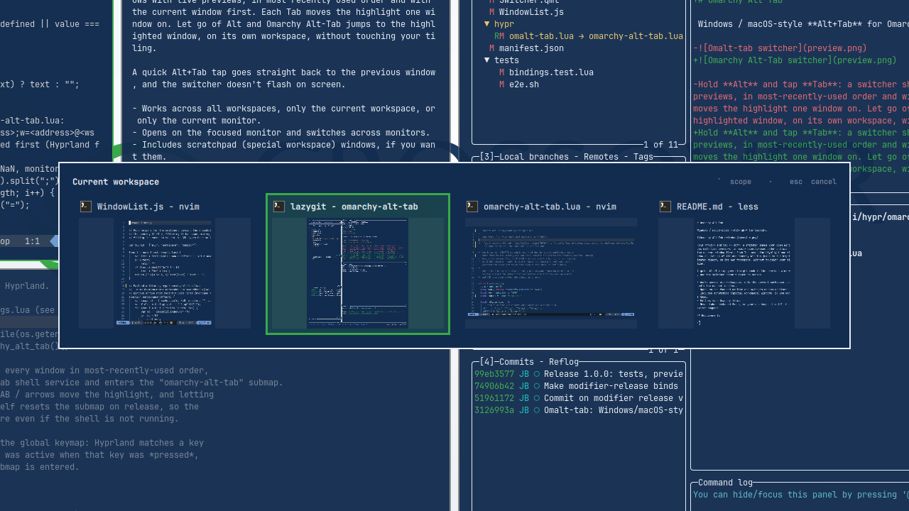

# Omarchy Alt-Tab

Windows / macOS-style **Alt+Tab** for Omarchy.



Hold **Alt** and tap **Tab**: a switcher shows your open windows with live previews, in most-recently-used order and with the current window first. Each Tab moves the highlight one window on. Let go of Alt and Omarchy Alt-Tab jumps to the highlighted window, on its own workspace, without touching your tiling.

A quick Alt+Tab tap goes straight back to the previous window, and the switcher doesn't flash on screen.

- Works across all workspaces, only the current workspace, or only the current monitor.
- Opens on the focused monitor and switches across monitors.
- Includes scratchpad (special workspace) windows, if you want them.
- Follows your Omarchy theme.
- Never takes keyboard focus, so your app keeps it until the switch happens.

## Requirements

- Omarchy 4 (Quattro) with the native shell plugin system and the Lua Hyprland config
- Nothing else. Omarchy Alt-Tab adds no packages, services or daemons.

## Install

```sh
omarchy plugin add https://github.com/jburchel/omarchy-alt-tab.git --enable
```

Omarchy Alt-Tab doesn't change your keybindings by itself. Add this to `~/.config/hypr/bindings.lua`:

```lua
-- Omarchy Alt-Tab window switcher. Replaces Omarchy's default ALT+TAB / ALT+SHIFT+TAB.
local omarchy_alt_tab = loadfile(os.getenv("HOME") .. "/.config/omarchy/plugins/io.github.jburchel.omarchy-alt-tab/hypr/omarchy-alt-tab.lua")
if omarchy_alt_tab then omarchy_alt_tab()() end
```

Run `hyprctl reload`, then check that `hyprctl configerrors` prints nothing.

The block does nothing if the plugin is removed, and Omarchy's defaults come back.

To use another modifier, pass options, e.g. `omarchy_alt_tab()({ modifier = "SUPER" })`. The modifier can be `ALT`, `SUPER` or `CTRL`.

## Keys

| Keys (while holding Alt) | Action |
| --- | --- |
| Tab / → | Next window |
| Shift+Tab / ← | Previous window |
| ↓ / ↑ | Down / up a row |
| ` (backtick) | Change scope for this switch only: all workspaces → current workspace → current monitor |
| Release Alt, or Enter | Switch to the highlighted window |
| Esc | Cancel |

You can also move the mouse over a card to highlight it, and click it to switch.

## Settings

```sh
omarchy-shell omarchy-alt-tab settings
```

This opens a settings panel you can use with the keyboard or mouse. Changes apply straight away.

| Setting | Values | Default |
| --- | --- | --- |
| Windows shown | All workspaces, Current workspace, Current monitor | All workspaces |
| Show switcher | Instantly, 120 ms, 250 ms, 400 ms. With a delay, quick taps switch without flashing the switcher. | 120 ms |
| Cards | Live previews, App icons | Live previews |
| Workspace badges | on / off | on |
| Scratchpad windows | on / off | on |

Every setting can also be set from scripts:

```sh
omarchy-shell omarchy-alt-tab scope workspace      # all | workspace | monitor
omarchy-shell omarchy-alt-tab showDelay 0          # 0-1000 ms
omarchy-shell omarchy-alt-tab previews off         # on | off
omarchy-shell omarchy-alt-tab workspaceBadges off  # on | off
omarchy-shell omarchy-alt-tab includeSpecial off   # on | off
omarchy-shell omarchy-alt-tab status               # current settings
omarchy-shell omarchy-alt-tab state                # live switcher state
```

Settings are stored in the plugin's entry in `~/.config/omarchy/shell.json`.

## Update

```sh
omarchy plugin update io.github.jburchel.omarchy-alt-tab
```

## Remove

Delete the Omarchy Alt-Tab block from `~/.config/hypr/bindings.lua`, then:

```sh
omarchy plugin remove io.github.jburchel.omarchy-alt-tab --yes
hyprctl reload
```

## How it works

- **Opening:** `hypr/omarchy-alt-tab.lua` binds Alt+Tab. On the first press it takes a snapshot of every window, sorted by Hyprland's `focus_history_id`, and sends it to the shell as a custom event. It then enters an `omarchy-alt-tab` submap, where Tab, arrows and backtick send more events.
- **Releasing Alt:** releasing Alt sends `commit` and resets the submap. The release binds sit in the global keymap, because Hyprland matches a key release against the submap that was active when the key was pressed. They're also `transparent`, because Hyprland shadows binds on keys that are still held once Alt+Tab has fired.
- **Shell side:** `Switcher.qml` is an Omarchy shell service that draws the overlay on the focused monitor. Cards show live `ScreencopyView` previews.
- **Switching:** Omarchy Alt-Tab calls `hl.dsp.focus({ window = "address:…" })`. Hyprland moves to the window's workspace and leaves the layout alone.

## Performance

Live previews use roughly a third of one CPU core, and only while the switcher is on screen. Icon mode and a closed switcher cost nothing noticeable.

## Security

- Omarchy Alt-Tab runs unsandboxed inside Omarchy Shell with your user's permissions.
- It reads window, workspace and monitor state from Hyprland and focuses the window you choose.
- Its only writes are to its own entry in `~/.config/omarchy/shell.json`.
- No network, no privilege escalation, no package installs, no install hooks, and no automatic keybinding changes.

## Tests

Run these from the plugin directory:

```sh
node tests/window-list.test.js   # ordering, scopes, selection, layout, icon matching
lua tests/bindings.test.lua      # the Hyprland binds, against a stub `hl`
tests/e2e.sh                     # end to end against your live session
omarchy plugin validate .
```

`tests/e2e.sh` needs `jq` and `foot`. It opens three throwaway terminals on a spare workspace and replays what the keybindings dispatch. It checks 59 things: ordering, stepping, wrap-around, scopes, special workspaces, windows closing mid-switch, empty workspaces, multiple monitors, fullscreen, the show delay and settings. Afterwards it restores your focus, cursor and settings.

Physical key presses can't be injected, so check these by hand after changing the bindings:
- a quick Alt+Tab tap goes back to the previous window
- holding Alt, tapping Tab and releasing switches to the highlighted window
- Alt+Shift+Tab walks backwards
- pressing Shift before Alt still switches on release

After editing `Switcher.qml` or `SwitcherCard.qml`, run `omarchy restart shell`, because the shell caches service QML. The settings overlay reloads on save.

## License

MIT
